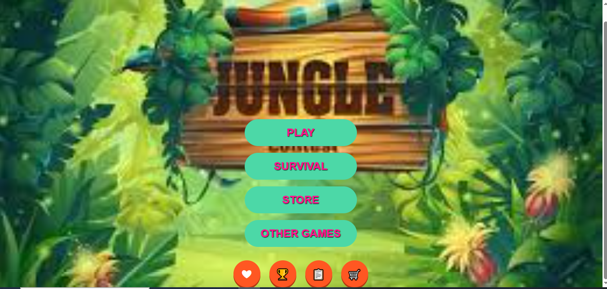

# 🕹️ Jungle Game Launcher – HTML/CSS UI Project

A creative, single-page game launcher interface built using pure HTML and internal CSS. Styled with custom hover effects, buttons, icons, and vibrant background. Each button links to an external gaming site for interactive redirection.

---

## ✨ Features

- Single HTML file with clean internal CSS
- Jungle-themed background and colorful layout
- Hover effects and vibrant interactive buttons
- FontAwesome or similar icons for UI enhancements
- Navigation links to external websites (real game portals)

---

## 📷 Preview

---

## 🛠 Technologies Used

- HTML5
- CSS3 (inline via `<style>` tag)
- Icons via CDN (like FontAwesome)

---

## 🚀 How to Use

1. Clone or download this repository
2. Open `index.html` in any modern web browser
3. Click on buttons to visit external games

---

## 📁 Folder Structure
jungle-game-launcher/
├── index.html
└── preview.png

---

## 👩‍💻 Author

**S. Misha**  
Aspiring Frontend & Full Stack Developer  
[GitHub Profile](https://github.com/Mi-Isha16)

